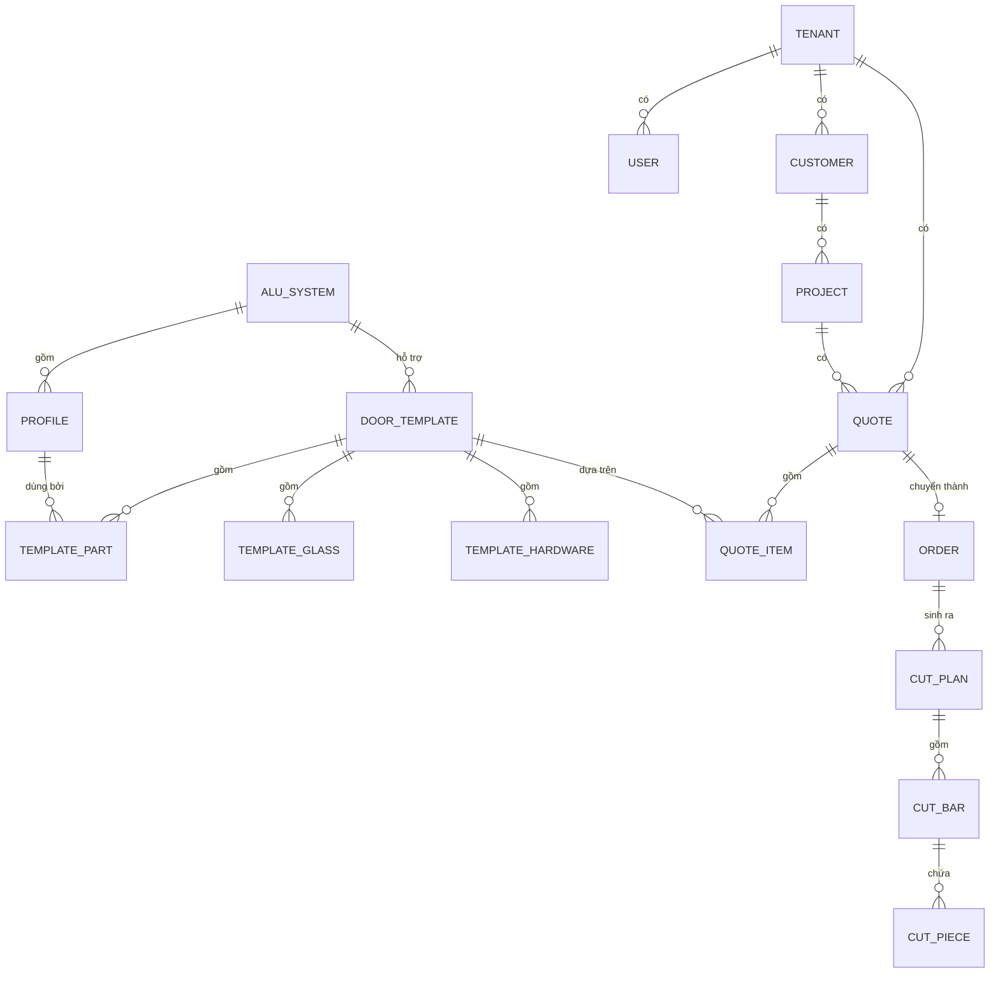

# 3. Mô hình dữ liệu

## 3.1 Sơ đồ quan hệ



## 3.2 Nhóm bảng danh mục

### `alu_system` — hệ nhôm
| Cột | Kiểu | Ghi chú |
|---|---|---|
| id | uuid | |
| tenant_id | uuid NULL | NULL = danh mục dùng chung |
| code | text | `XINGFA55`, `XINGFA63`, `VP55` |
| name | text | "Xingfa 55 hệ mở quay" |
| default_stock_length_mm | int | 5850 |
| constants | jsonb | ⭐ `{"Bk":55,"Bc":55,"Bd":60,"c":10,"k":4,"n":2}` |

`constants` là bộ **hằng số trừ hao** dùng trong công thức. Để JSONB vì mỗi hệ có bộ
biến khác nhau, và người dùng phải sửa được qua giao diện.

### `profile` — thanh nhôm
| Cột | Kiểu | Ghi chú |
|---|---|---|
| id, tenant_id | uuid | |
| system_id | uuid | |
| code | text | Mã nhà sản xuất, ví dụ `XF55-01` |
| name | text | "Khung bao 55" |
| part_role | enum | `OUTER_FRAME`, `SASH`, `MULLION_FIXED`, `MULLION_MOVING`, `GLAZING_BEAD`, `ADAPTER` |
| gram_per_m | int | ⭐ Dùng để tính khối lượng → tiền |
| visible_width_mm | int | Bề rộng nhìn thấy, dùng trong công thức |
| stock_length_mm | int | 5850, có thể khác hệ |

### `finish` — màu / hoàn thiện
`code`, `name` ("Trắng sứ", "Ghi", "Vân gỗ", "Đen"), `price_multiplier` (vân gỗ đắt hơn ~15%).

### `profile_price` — giá nhôm
`profile_id`, `finish_id`, `price_per_kg` (BigInt, đồng), `valid_from`.
Giá nhôm đổi liên tục → lưu theo mốc thời gian, **không ghi đè**. Báo giá cũ phải
tra được giá tại thời điểm lập.

### `glass_type` / `hardware_item`
- `glass_type`: `code`, `name`, `thickness_mm`, `price_per_m2`, `min_area_mm2`, `round_to_mm`
- `hardware_item`: `code`, `name`, `unit` (`CAI`/`BO`/`MET`/`KG`), `price`

## 3.3 Nhóm bảng mẫu cửa — trái tim hệ thống

### `door_template`
| Cột | Kiểu | Ghi chú |
|---|---|---|
| code | text | `MQ2C` = mở quay 2 cánh |
| name | text | "Cửa sổ mở quay 2 cánh" |
| system_id | uuid | |
| sash_count | int | Số cánh |
| params | jsonb | Tham số cho phép người dùng nhập thêm, ví dụ `{"co_o_fix_tren": false}` |
| drawing_kind | text | Khoá để chọn hàm vẽ SVG |

### `template_part` ⭐ — công thức bóc tách
| Cột | Kiểu | Ghi chú |
|---|---|---|
| template_id | uuid | |
| label | text | "Khung bao ngang" |
| profile_id | uuid | |
| qty_expr | text | Biểu thức, ví dụ `2` hoặc `sash*2` |
| length_expr | text | ⭐ Biểu thức, ví dụ `W - 2*Bk + 2*c - k` |
| cut_angle | enum | `A45`, `A90`, `A45_90` |
| sort_order | int | |

Cột `length_expr` là **chuỗi biểu thức lưu trong DB, không phải code**. Người dùng
sửa được qua giao diện. Biến khả dụng: `W`, `H`, `sash`, tất cả khoá trong
`alu_system.constants`, và chiều dài của các thanh đã tính trước đó (tham chiếu theo
`label`) — nhờ vậy nẹp kính có thể tính từ chiều dài cánh.

### `template_glass`
`label`, `qty_expr`, `width_expr`, `height_expr` — cùng cơ chế biểu thức.

### `template_hardware`
`hardware_id`, `qty_expr`, ví dụ:
- Bản lề: `sash * (H >= 2000 ? 3 : 2)`
- Gioăng cánh (mét): `sash * 2 * (Lcanh_ngang + Lcanh_dung) / 1000`
- Ke góc: `4 + sash * 4`

## 3.4 Nhóm bảng bán hàng

### `customer`, `project`
Thông tin cơ bản + `price_list_id` (mỗi khách có thể có bảng giá riêng).

### `quote` — báo giá
`code`, `customer_id`, `project_id`, `status` (`DRAFT`/`SENT`/`ACCEPTED`/`REJECTED`),
`pricing_mode` (`PER_M2` / `DETAILED`), `markup_percent`, `waste_percent`,
`total_cost`, `total_price`, `created_by`, `snapshot` (jsonb).

> ⭐ **`snapshot` là cột quan trọng bị bỏ quên nhiều nhất.** Khi báo giá được gửi đi,
> phải đóng băng toàn bộ giá vật tư và công thức tại thời điểm đó vào JSONB. Tháng sau
> giá nhôm tăng, mở lại báo giá cũ mà số tiền tự nhảy thì khách sẽ mất niềm tin — và
> bạn không cãi được.

### `quote_item` — một dòng = một loại bộ cửa
`template_id`, `width_mm`, `height_mm`, `quantity`, `finish_id`, `glass_type_id`,
`options` (jsonb), `unit_price`, `line_total`, `computed` (jsonb — kết quả bóc tách đã tính).

## 3.5 Nhóm bảng sản xuất

### `order` → `cut_plan` → `cut_bar` → `cut_piece`

- `cut_plan`: `order_id`, `profile_id`, `finish_id`, `stock_length_mm`,
  `bars_used`, `waste_mm`, `waste_percent`, `algorithm`, `created_at`
- `cut_bar`: `plan_id`, `bar_index`, `used_mm`, `remain_mm`
- `cut_piece`: `bar_id`, `length_mm`, `angle`, `quote_item_id`, `label`, `position_mm`

Lưu `quote_item_id` ở từng đoạn cắt để thợ biết đoạn này thuộc bộ cửa nào — bắt buộc
khi một đơn có nhiều loại cửa trộn lẫn trên cùng một cây nhôm.

### `inventory` / `stock_movement` (Phase 6)
Tồn kho theo `profile_id + finish_id`, đơn vị **cây nguyên** và **đầu thừa**
(`remnant` — các đoạn dư > 500 mm cần được tái sử dụng ở đơn sau; đây là tính năng
tiết kiệm tiền thật cho xưởng và rất ít phần mềm làm tốt).

## 3.6 Nhóm bảng hệ thống

- `tenant`: `name`, `tax_code`, `plan`, `expires_at`, `status`
- `user`: `tenant_id`, `phone` (⭐ đăng nhập bằng **số điện thoại**, không phải email —
  thợ và chủ xưởng Việt Nam dùng số điện thoại), `password_hash`, `role`
- `subscription`, `payment`: gói, chu kỳ, lịch sử thanh toán
- `audit_log`: ai sửa công thức / bảng giá lúc nào — cần khi có tranh chấp "ai làm sai
  kích thước"

## 3.7 Prisma schema mẫu (phần lõi)

```prisma
enum PartRole {
  OUTER_FRAME
  SASH
  MULLION_FIXED
  MULLION_MOVING
  GLAZING_BEAD
  ADAPTER
}

enum CutAngle { A45  A90  A45_90 }

model AluSystem {
  id                   String   @id @default(uuid())
  tenantId             String?
  code                 String
  name                 String
  defaultStockLengthMm Int      @default(5850)
  constants            Json
  profiles             Profile[]
  templates            DoorTemplate[]

  @@unique([tenantId, code])
}

model Profile {
  id              String    @id @default(uuid())
  tenantId        String?
  systemId        String
  system          AluSystem @relation(fields: [systemId], references: [id])
  code            String
  name            String
  partRole        PartRole
  gramPerM        Int
  visibleWidthMm  Int
  stockLengthMm   Int       @default(5850)
  parts           TemplatePart[]

  @@unique([tenantId, systemId, code])
  @@index([systemId, partRole])
}

model DoorTemplate {
  id          String    @id @default(uuid())
  tenantId    String?
  systemId    String
  system      AluSystem @relation(fields: [systemId], references: [id])
  code        String
  name        String
  sashCount   Int       @default(1)
  drawingKind String
  params      Json      @default("{}")
  parts       TemplatePart[]

  @@unique([tenantId, code])
}

model TemplatePart {
  id         String       @id @default(uuid())
  templateId String
  template   DoorTemplate @relation(fields: [templateId], references: [id], onDelete: Cascade)
  profileId  String
  profile    Profile      @relation(fields: [profileId], references: [id])
  label      String
  qtyExpr    String       @default("1")
  lengthExpr String
  cutAngle   CutAngle     @default(A45)
  sortOrder  Int          @default(0)

  @@index([templateId, sortOrder])
}
```

## 3.8 Dữ liệu mồi (seed) tối thiểu để chạy được

1. 1 hệ nhôm: Xingfa 55, kèm `constants`
2. 5 profile: khung bao, cánh, đố động, đố cố định, nẹp kính
3. 4 màu
4. 3 loại kính
5. 8 phụ kiện
6. 4 mẫu cửa: mở quay 1 cánh, mở quay 2 cánh, vách fix, mở trượt 2 cánh

Viết seed bằng script có thể chạy lại nhiều lần (idempotent, dùng `upsert`) — bạn sẽ
chạy nó hàng trăm lần trong lúc phát triển.
